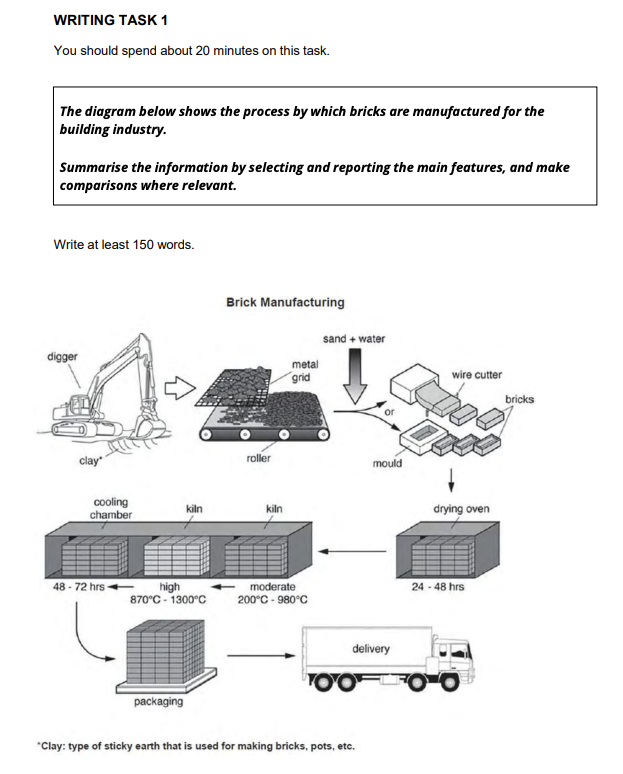

IELTS prep 

[location of folder moved to PUBLIC folder]

last updated = 8 sept 2026 

assumption => 
    - apply univ master on the december 2026 - up to march 2027 
    - then if i take the the ielts on the november 2026 -

validity of IELTS certif = 2 years

target =
    - start doing ielts reading and writing prep on google 
    - start ielts speaking too 

past score => 
    - test date = 6 august 2023
    - listening = 7.5 
    - reading = 8.5 
    - writing = 7.0
    - speaking = 6.5 

Priority to improve => 
    Speaking (already preimproved with )
    Writing
    reading
    listening 

# WRITING SECTION 

Pattern => 
    section 1 = 20 minutes 

Personal questions => 
    - can outer topics that are connected to the theme of the picture be included in text

## PRACTICE 1 -- write at least 150 words = 
source = https://ielts.org/take-a-test/preparation-resources/sample-test-questions/academic-test 
    -[to be done AFTER learning some sample]

### PRACTICE 2 SAMPLE ANSWER -- study pattern
source = https://ielts.org/cdn/Sample-tests/ielts-academic-writing-sample-tasks-2023.pdf

#### q1C  
- question about brick manufacturing 
- personal main observations => 
    - pict shows steps of Manufacturing for building industry 
    - there are 7 main steps 
    -  
Brick Manufacturing 
The process by which bricks  

