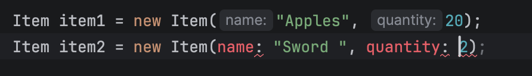

## Learn Java from YT md 26 April 2026 

INSIGHTS vid 1 = 
    - java doesnt have functions, but METHODS  
    - difference bween normal "print" and "println" => 
        suppose there is a loop to print char by char, print will print it in ONE line while println will print it in different new lines 

## Continue 27 April -- YT learn OOP 

The 4 big key concepts OOP = Encapsulation, Inheritance, Polymorphism, Abstraction

1. Encapsulation = 
    object need attributes 
    every new item made is a new object 

    private type cannot be directly accessed from OUTSIDE the class 
        in order to access / assign values, need to use get

    therefore when accessing private protected attributes with get() methods, is called as encapsulation. 
         keeps details inside the class safe and provide controlled ways to access or modify it 
        
    to create an object using an existing blueprint -> use "this.[]" 
        allow to have parameters to have the same name as attributes 
        example = name2, name3, name4, etc. 

    make new inventory.java 

    arrayList = specialized subset of non primitive data typee
        array can string integer, but it cannot store object 
        array is fixed 
        array list is RESIZEABLE
        array list CAN store object 
    
    constructor => public inventory 
        allows to use the class template to make a new inventory object 

    class != constructor 
        Example = Inventory inventory = new Inventory(); 
            the first "inventory" is the class name 
            the second "inventory"

    things like ".addItem()" are built-in 
    
    - we are NOT supposed to write parameter's variable manually in Java (in fact we shouldnt write it), as it will be automatically known 
        

2. Inheritance
    - public class Fruit extends Item = 
        Item is supercalss, Fruit is the subclass to Item, Fruit inherits all methods in Item as its own,, therefore no need to redefine 
    
    super(name, quantity); // pull in attributes that are inherited from superclass 

CURRENT PROGRESS => minute 12:33 